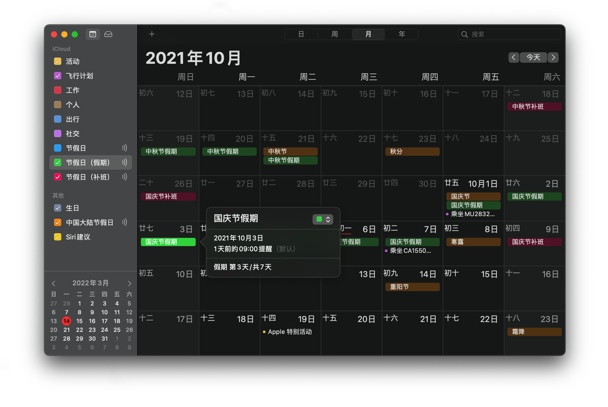
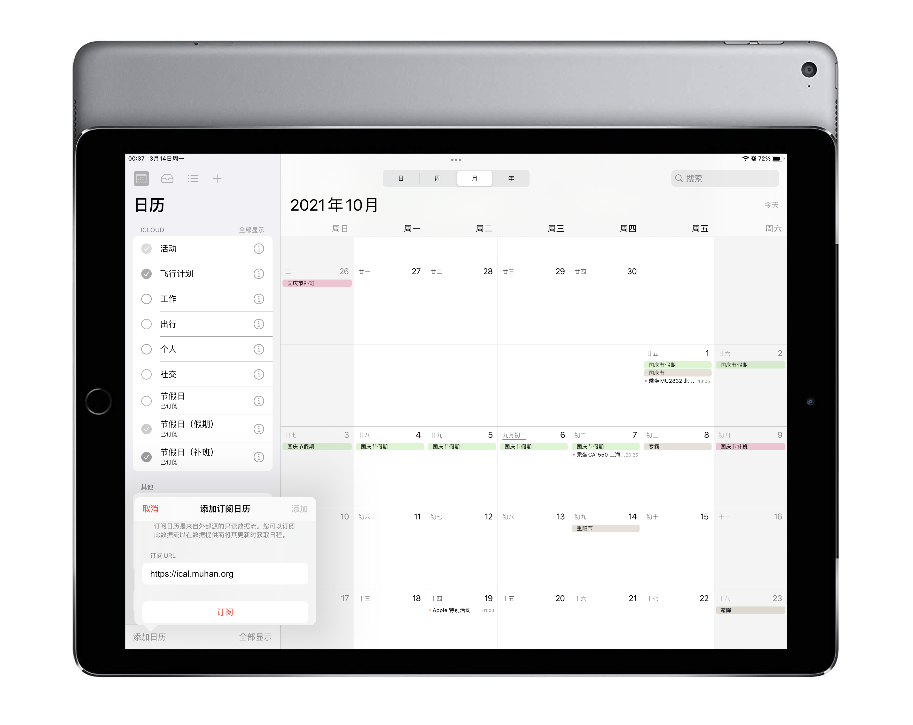
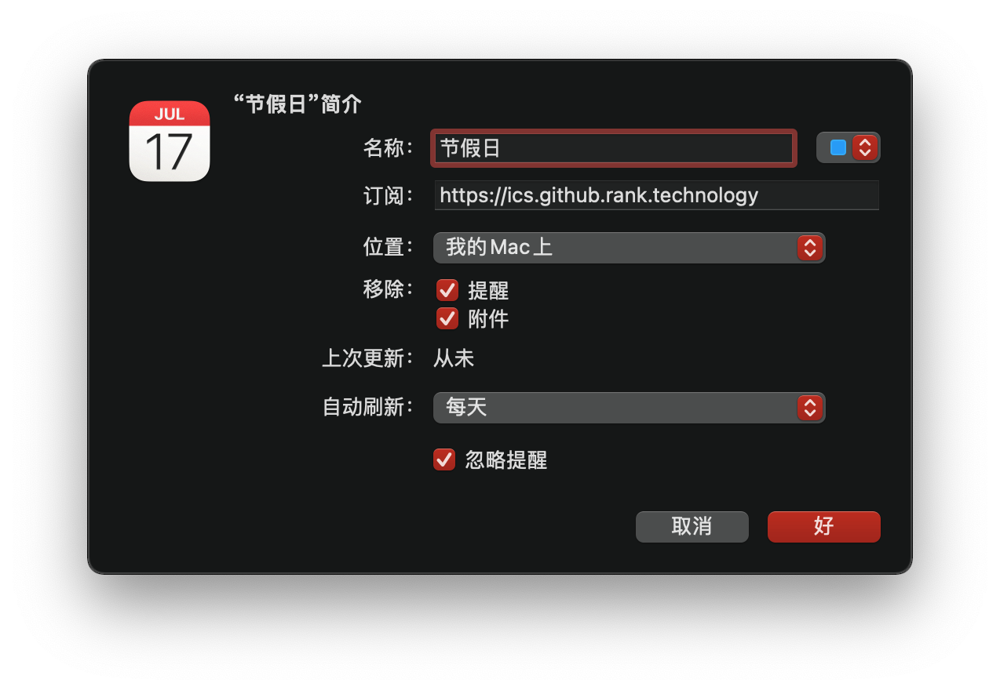
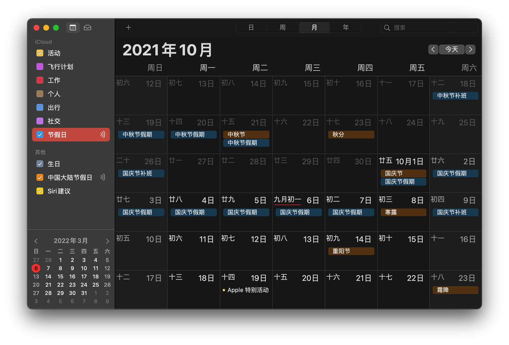

# 中国大陆节假日安排 · 日历订阅  Chinese Holidays Calendar

Subscription link of public holidays in mainland China

> Calendar data updated at 8:57 on November 11, 2023

## Demo

## 如何订阅

### iOS / iPadOS

日历 - 添加日历 - 添加订阅日历 - 输入链接  
「 [https://ics.github.rank.technology](https://ics.github.rank.technology) 」

### macOS

日历 - 文件 - 新建日历订阅 - 输入链接  
「 [https://ics.github.rank.technology](https://ics.github.rank.technology) 」

## 为补班添加不同的颜色

分别订阅
- 假期：「 [https://ics.github.rank.technology/rest.ics](https://ics.github.rank.technology/rest.ics) 」
- 补班：「 [https://ics.github.rank.technology/work.ics](https://ics.github.rank.technology/work.ics) 」

给他们分配不同的颜色吧～

## iOS 自动节假日闹钟

在周一至周五、调休补班日期自动打开标签内容包含「工作日闹钟」的闹钟  
在周六、周日以及节假日假期自动关闭标签内容包含「工作日闹钟」的闹钟

[戳此](https://www.icloud.com/shortcuts/71ddab11837b408188821c3d992e8e4c) 导入 iOS 快捷指令脚本，在「快捷指令」App 中设定一个每天凌晨运行的自动化任务吧～

## 维护者

[@muhac](https://github.com/muhac)

